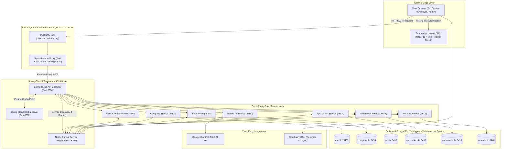

# Job Portal Microservices System — Architecture & Deployment Documentation

## 1. Executive Summary & System Overview

The **AI-Powered Job Portal** is an enterprise-grade, distributed microservices platform engineered with **Java 21, Spring Boot 4, Spring Cloud, PostgreSQL, React 18 (Vite + Redux Toolkit), Docker, and Google Gemini AI**.

The system is deployed on a **Hostinger Linux VPS (Ubuntu 24.04 LTS)** using **Docker Compose** orchestration behind an **Nginx Reverse Proxy** with automated **Let's Encrypt SSL/TLS encryption**, serving a global frontend hosted on **Vercel CDN**.

---

## 2. High-Level Architecture Diagram



---

## 3. Microservices Domain Breakdown

| Service Name | Port | Database | Primary Responsibilities |
| :--- | :---: | :---: | :--- |
| **API Gateway** | `5000` | — | Central entry point, route dispatching, CORS enforcement, stateless JWT verification, rate limiting. |
| **Service Registry (Eureka)** | `8761` | — | Dynamic service discovery, instance heartbeat tracking, load-balanced inter-service resolution. |
| **Config Server** | `8888` | — | Centralized Git/local properties repository, environment-specific configurations. |
| **User Service** | `9001` | `job_portal_user` (`5433`) | User registration, authentication, BCrypt password hashing, JWT generation, admin user management. |
| **Company Service** | `9002` | `job_portal_company` (`5434`) | Employer company profiles, business verification, branding, company search. |
| **Job Service** | `9003` | `job_portal_job` (`5435`) | Job postings CRUD, categories, technical skills taxonomy, tags, search & filtering, Feign client to Company. |
| **Application Service** | `9004` | `job_portal_application` (`5436`) | Job application lifecycle (`APPLIED`, `UNDER_REVIEW`, `INTERVIEW`, `ACCEPTED`, `REJECTED`), applicant tracking. |
| **Preference Service** | `9008` | `job_portal_preference` (`5439`) | Bookmarking/saved jobs, user notification preferences, custom job alerts. |
| **Resume Service** | `9009` | `job_portal_resume` (`5440`) | Multi-section resume builder (work experience, education, projects, certifications, skills, PDF generation). |
| **AI Service** | `9010` | — | Google Gemini AI integration: automatic job description generation, salary market estimation, skill recommendation, candidate resume match scoring. |

---

## 4. Production Hosting & Deployment Architecture

### 4.1 Server Specification & Host Details
* **Provider**: Hostinger VPS (India - Mumbai / Singapore DC)
* **Public IPv4**: `213.210.37.56` (`srv1939343`)
* **Operating System**: Ubuntu 24.04 LTS (64-bit)
* **Physical Hardware**: 1 vCPU, 4.0 GB RAM, 50 GB NVMe SSD
* **Effective Memory Pool**: **8.0 GB** (4.0 GB Physical RAM + 4.0 GB NVMe Swap Space)

### 4.2 Low-Memory Microservices Engineering Strategy
Running 10 Java JVMs + 6 PostgreSQL databases on a 4GB VPS without crashes requires precise JVM memory tuning:
1. **Garbage Collection Optimization**: `-XX:+UseSerialGC` reduces garbage collection metadata overhead and CPU contention compared to G1GC on single-vCPU environments.
2. **Strict Heap Bounds**: `-Xms64m -Xmx192m` per service constrains Java heap footprint to under 200MB active working memory.
3. **Container Resource Limits**: Every Docker container is capped at `mem_limit: 512m` with `mem_reservation: 256m` and `cpus: 0.5`.
4. **Linux Swap Safety Buffer**: 4GB swapfile on NVMe prevents Out-Of-Memory (OOM-killer) termination during simultaneous container boot phases.

### 4.3 Networking & Security Setup
* **DNS Subdomain**: `api-jobportal.duckdns.org` pointing to `213.210.37.56`.
* **Reverse Proxy**: Nginx listening on port 80 (HTTP redirect) and port 443 (HTTPS).
* **SSL/TLS**: Automated Let's Encrypt certificate via Certbot with auto-renewal cron.
* **Payload Limits & Timeouts**: `client_max_body_size 50M` with 120-second proxy timeouts to support large resume uploads and generative AI latency.
* **CORS Policy**: Configured in API Gateway (`CorsConfig.java`) with `setAllowedOriginPatterns(List.of("*"))` and `setAllowCredentials(true)`.

---

## 5. Frontend Architecture & Vercel Hosting

* **Framework**: React 18 + Vite (SPA)
* **Styling**: Tailwind CSS + Shadcn UI component primitives + Lucide React icons
* **State Management**: Redux Toolkit with 10 domain slices mirroring backend services
* **Routing**: React Router v6 with `ProtectedRoute` and `RoleBasedRoute` (`ROLE_JOB_SEEKER`, `ROLE_EMPLOYER`, `ROLE_ADMIN`)
* **SPA Routing on CDN**: `vercel.json` rewrite rule `{"source": "/(.*)", "destination": "/index.html"}` ensuring zero 404 errors on deep URL reloads.
* **API Communication**: Central Axios instance ([frontend/src/store/api.js](file:///d:/work/Projects/Job%20Portal/frontend/src/store/api.js)) with automated JWT Bearer injection and 401 interceptors.

---

## 6. Runbook & Maintenance Operations

### 6.1 Inspecting Service Health
```bash
# Connect to VPS
ssh root@213.210.37.56

# Check status of all 23 containers
cd /opt/job-portal
docker compose ps

# Check system memory usage
free -h

# Stream logs of a specific service
docker compose logs -f gateway
docker compose logs -f discovery
docker compose logs -f job-service
```

### 6.2 Redeploying Services After Code Changes
```bash
# On your local machine (Build & Push via Jib):
cd "d:\work\Projects\Job Portal\job-portal-system\common-lib"
mvn clean install -DskipTests
cd "d:\work\Projects\Job Portal\job-portal-system"
mvn compile jib:build -DskipTests

# On the VPS (Pull & Restart without downtime):
cd /opt/job-portal
docker compose pull
docker compose up -d
```

### 6.3 Database Backup & Restore
```bash
# Backup jobdb
docker exec -t job-portal-jobdb pg_dump -U postgres job_portal_job > /root/jobdb_backup.sql

# Restore jobdb
cat /root/jobdb_backup.sql | docker exec -i job-portal-jobdb psql -U postgres -d job_portal_job
```
